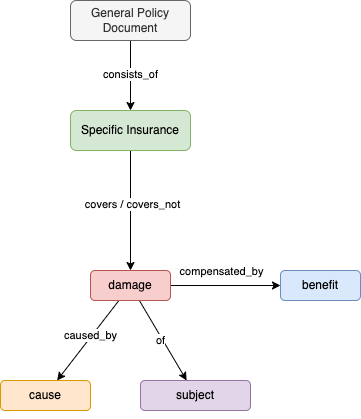
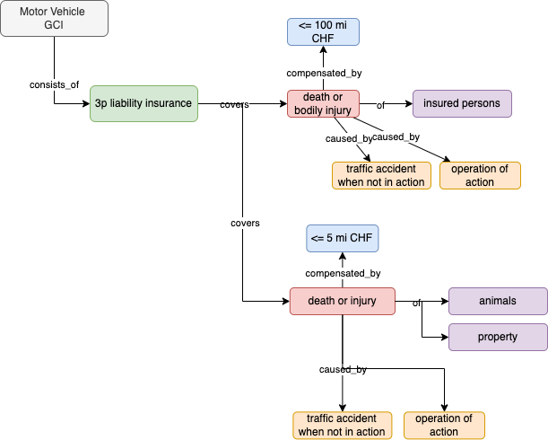

# zurihack

## Architecture

### (Offline) Insurance Knowledge Graph Extraction


#### Example



### RAG-based Policy Assistant

### Intent Detector

### Online Claim Specialist

## Setup

PyCharm can setup `pipenv` automatically https://www.jetbrains.com/help/pycharm/pipenv.html#pipenv-requirements

## Running streamlit
Run
```
cd configurations/bins
export OPENAI_API_KEY=REPLACE_ME
./run_webapp.sh
```

Alternative with PyCharm: create a Run Configuration using `webapp/main.py` and the interpreter option `-m streamlit run`

### Python Tooling

* Black: `pip3 install black`

### Development Tooling

* AWS CLI: https://docs.aws.amazon.com/cli/latest/userguide/getting-started-install.html